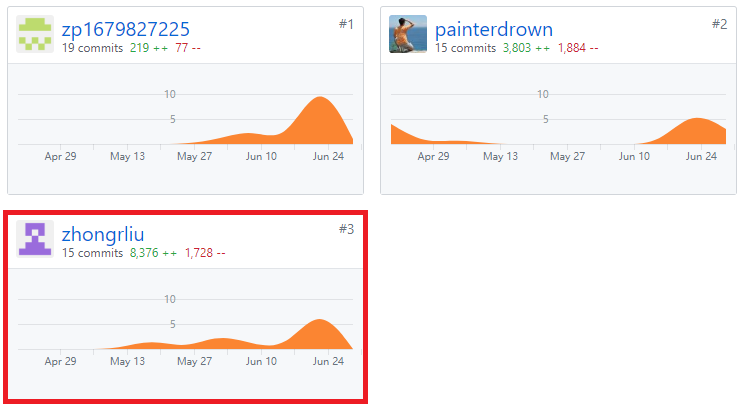

## 个人总结

在本次课程项目开发过程中，我主要负责后端开发，使用基于Nodejs的koa框架

技术方面，通过本次课程我对nodejs有了更深入的了解，包括中间件的使用，模块的调用，通过封装promise来处理异步函数返回的问题等技术

在项目管理方面，我对于github的使用更熟悉了，之前使用git都是将代码上传到自己的远程仓库，因为只有自己上传，情况比较简单，在这次项目中，我和zp1679827225共同负责后端代码开发，所以每次push到远程仓库之前可能远程仓库有本地仓库没有的push，所以要先git pull一次，由于我们两个负责不同模块，所以每次使用git pull拉取远程仓库最新代码只会改变本地仓库中zp1679827225负责的模块，虽然只是github和git最简单的应用场景之一，却使我认识到github作为全球第一的版本控制器的强大功能

通过本次课程，我也发现自己对javascript还不够熟悉，这里要特别感谢painterdrown，在技术层面他给了我许多指导，同时也要感谢共同负责后端开发的队友zp1679827225,以及前端担当SYSUZZY，设计担当MinxinZhong。

## PSP2.1统计表

| PSP阶段                    | 耗时(h) |
| :------------------------- | :------ |
| 计划                       | 2       |
| · 估计任务时间             | 2       |
| 开发                       | 70      |
| · 分析需求                 | 10      |
| · 生成设计文档             | 0      |
| · 设计复审                 | 6       |
| · 代码规范                 | 0       |
| · 具体设计                 | 45      |
| · 具体编码                 | 0       |
| · 代码复审                 | 0       |
| · 测试                     | 30       |
| 报告                       | 0.5     |
| ·测试报告                  | 0       |
| ·计算工作量                | 0.5     |
| 事后总结，提出过程改进计划 | 4       |
| **合计**                   | 170    |

## Git统计报告

## 有价值的工作
在controllers的query模块中封装Promise对象，以处理异步的数据库访问与后续同步代码的冲突